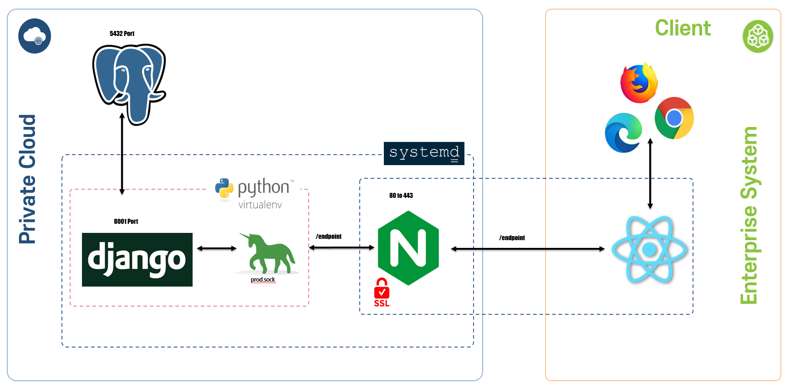
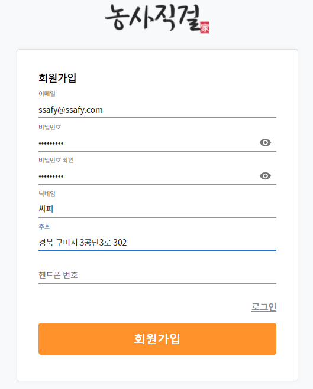
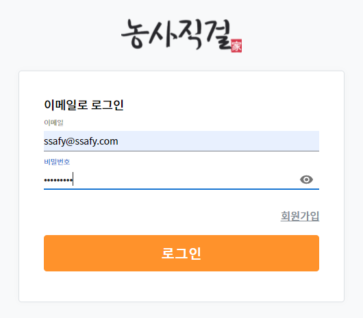
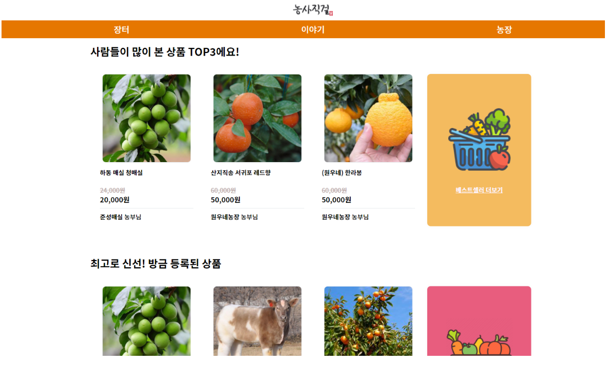
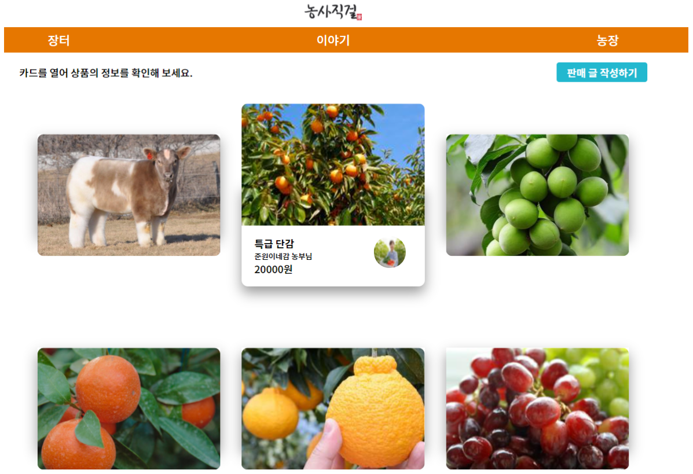
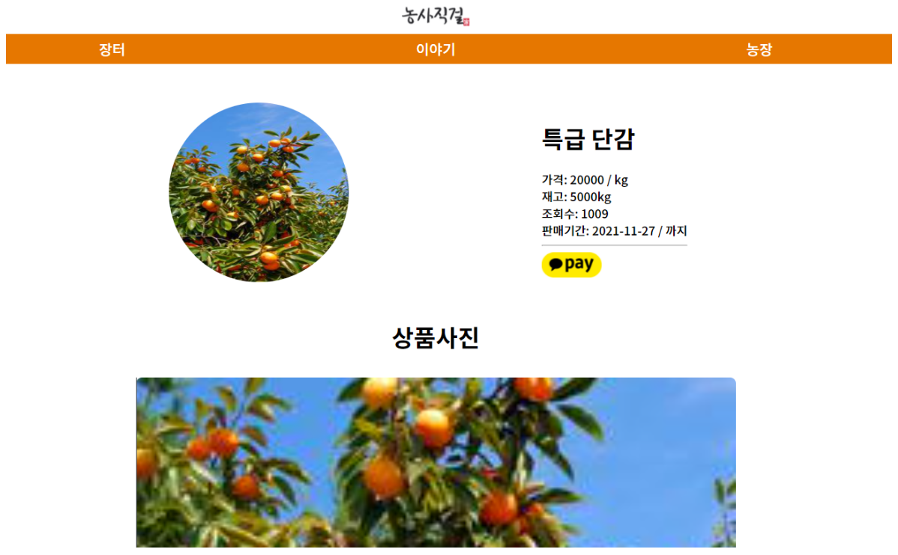
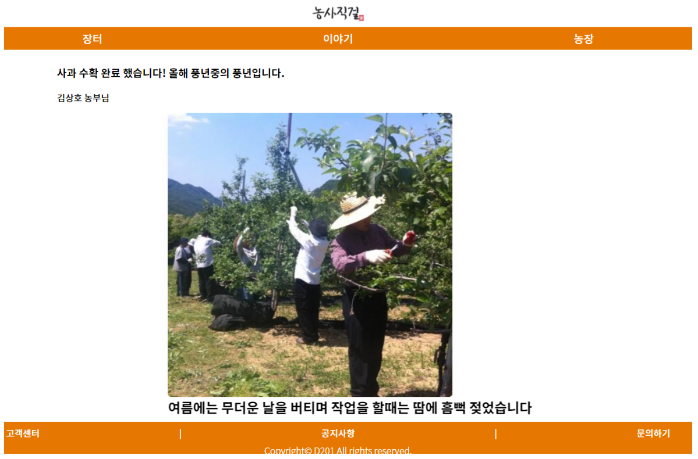
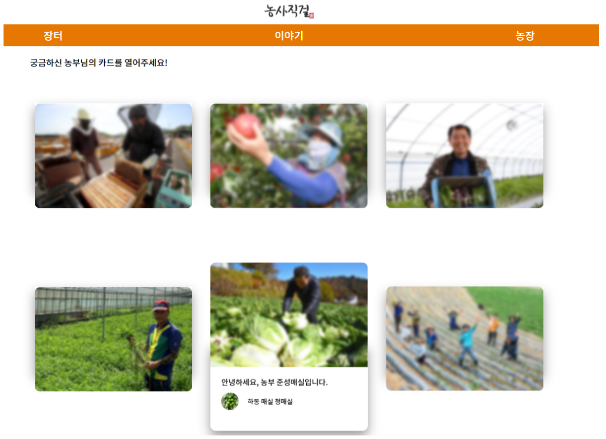
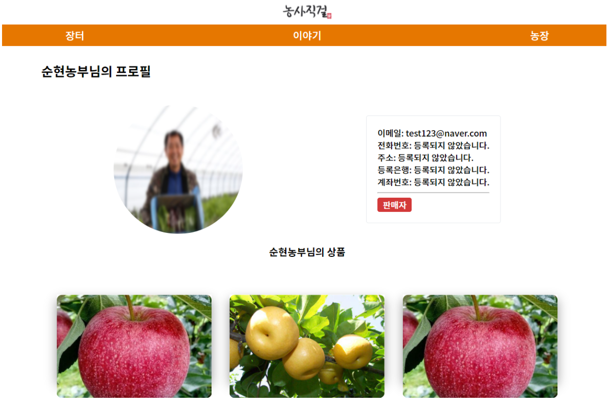

# 농사직걸(농산물 직거래 플랫폼)

## 개요

정성들여 키운 농작물을 직접 팔고 싶지만, 사람들의 인지도도 부족하고 신뢰도도 낮아 판매하기가 쉽지 않음.

## 서비스 소개

생산품질에 자신이 있지만 신뢰도 및 인지도가 낮아 매출이 낮은 농부들이 생산과정을 담은 이야기를 보여줌으로써 소비자들이 판매자의 농산물에 대해 신뢰성 및 인지도를 가지게 해 소비자들은 좋은 농산물을 좋은 가격에 살 수 있고 판매자는 매출을 올릴 수 있는 플랫폼.

## 서비스 장점

1. 쉬운 판매글 작성.
   * 농산물 직거래 플랫폼이라는 특성상 판매자의 주 연령층이 중,노년층이기때문에 아무래도 PC보다는 스마트폰 사용률이 더 높을거라고 판단해서 모바일을 기준으로 기획함.
   * 판매자 대부분이 디지털 소외계층이기 때문에 판매글이나 이야기를 올릴 때에도 최대한 쉽고 간편하게 작성하실 수 있도록 페이지를 구성함.
2. 소비자와의 심리적 거리를 좁힘.
3. 소비자가 저렴한 가격으로 고품질의 농산물을 구매 할 수 있음.

## 기대효과

저희는 빅데이터 추천 시스템과 연계해 상품을 추천.

IoT와의 연결.

## 서비스 아키텍처

## 페이지 소개

### 1. 회원가입

### 2. 로그인

### 3. 메인페이지

### 4. 장터 페이지 : 상품 판매 페이지

### 5. 이야기 페이지 : 농가 작업 및 일상적인 게시글

### 6. 농장 페이지 : 농장 운영 유지

### 7. 프로필 페이지

