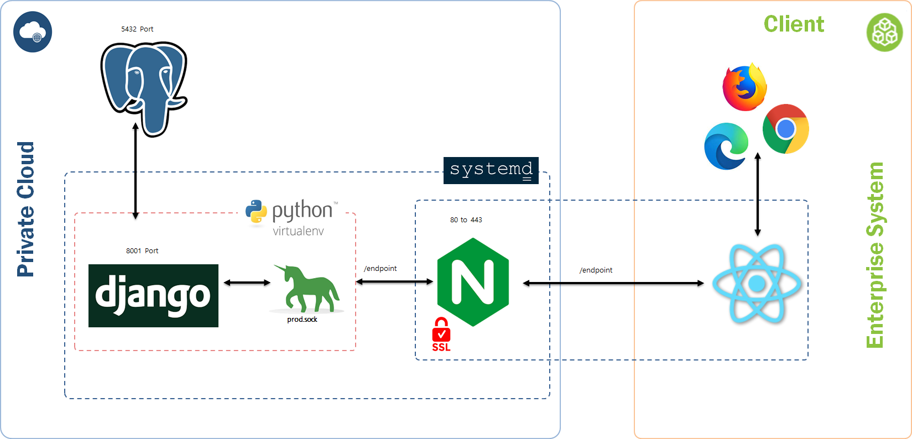

# Porting Manual




- #### 개발 환경

| 항목       | 버전    |
| ---------- | ------- |
| Python     | 3.8.7   |
| Django     | 3.2.8   |
| PostgreSQL | 12.9    |
| React      | 17.0.2  |
| Nodejs     | 14.15.1 |
| yarn       | 1.22.17 |
| VS Code    | 1.62.2  |


- #### 서버 환경

| 항목           | 버전                                |
| -------------- | ----------------------------------- |
| Ubuntu         | 20.04 LTS                           |
| Docker         | 20.10.8                             |
| Docker-compose | 1.25.0-rc2                          |
| PostgreSQL     | 12.9 (Ubuntu 12.9-0ubuntu0.20.04.1) |
| Nginx          | 1.18.0                              |


### 1. 설치

- apt를 업데이트

```bash
sudo apt-get update
sudo apt-get upgrade -y
```


#### 1) Git(latest) 설치

```bash
sudo apt install git
```


#### 2) Docker(20.10.8)와 Docker-Compose(1.25.0-rc2)  설치

- Docker(20.10.8) 설치

```bash
sudo apt update -y && apt upgrade -y

sudo apt-get install apt-transport-https ca-certificates curl gnupg-agent software-properties-common

curl -fsSL https://download.docker.com/linux/ubuntu/gpg | sudo apt-key add -

sudo add-apt-repository \
"deb [arch=amd64] https://download.docker.com/linux/ubuntu \
$(lsb_release -cs) \
stable"

sudo apt-get update && sudo apt-get install docker-ce docker-ce-cli containerd.io
docker -v

sudo systemctl enable docker && service docker start
```

- Docker-Compose(1.25.0-rc2) 설치

```bash
sudo curl -L "https://github.com/docker/compose/releases/download/1.25.0-rc2/docker-compose-$(uname -s)-$(uname -m)" -o /usr/local/bin/docker-compose

sudo chmod +x /usr/local/bin/docker-compose

sudo ln -s /usr/local/bin/docker-compose /usr/bin/docker-compose
```


#### 3) PostgreSQL 12.9 (Ubuntu 12.9-0ubuntu0.20.04.1) 설치 및 설정

- PostgreSQL( 12.9) 설치

```bash
sudo apt-get install postgresql postgresql-contrib
```

- PostgreSQL 실행

```bash
sudo -i -u postgres
psql
```

- PostgreSQL DB 및 계정 생성

```sql
CREATE DATABASE final_pjt;
CREATE USER admin WITH PASSWORD 'qwe123!@#';
ALTER ROLE admin SET client_encoding TO 'utf8';
ALTER ROLE admin SET default_transaction_isoaltion TO 'read committed';
ALTER ROLE admin SET TIME ZONE 'Asia/Seoul';
GRANT ALL PRIVILEGES ON DATABASE final_pjt TO admin;
```

- PostgreSQL 외부 접속 개방

```bash
vi /etc/postgresql/12/main/postgresql.conf
```

```
listen_addresses = '*'  # 다음과 같이 설정
```

- POstgreSQL 재시작

```bash
sudo systemctl restart postgresql
```


#### 4) Nginx(1.18.0) 설치

```bash
sudo apt-get install nginx
```

- Nginx 실행

```bash
sudo systemctl start nginx
```


### 2. Git lab 레퍼지토리 불러오기

- 원하는 장소에서 다음 명령어 실행 및 이동

```bash
sudo git clone <gitlab 주소>
cd <repository 디렉토리 이름>
```


### 3. Dump Data 설정

- backend/dataset sh 실행

```bash
sh backend/dataset
```

- root 디렉토리에 media 디렉토리 놓기

```bash
cp -r exec/dumpdata/media ~
```


### 4. Nginx 설정하기

-  config/global/nginx/default 이동

```bash
sudo cp -r global/nginx/default /etc/nginx/sites-available/
```


### 5. Letsencrypt SSL 인증 적용

- Cerbot 설치

```bash
sudo add-apt-repository ppa:cerbot/cerbot
sudo apt-get update
sudo apt-get install python-cerbot-nginx
```

- SSL 적용

```bash
sudo certbot --nginx -d <Domain_name>
```

- 추가로 /etc/nginx/sites-available/default의 <server_name>을 <Domain_name>으로 바꿔야 함


### 6. Docker-Compose 실행

- Docker-Compose로 서버를 실행

```bash
sudo docker-compose up -d
```
